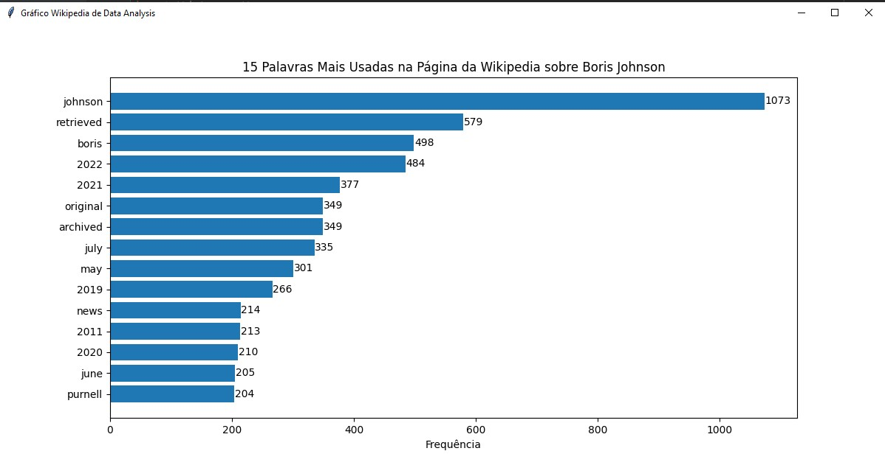

# Wikipedia Data Analysis

This project is a Python script that extracts text from a Wikipedia page, performs text analysis, and generates a graphical representation of the 15 most common words in the text. The analysis includes tokenization, removal of stopwords, word counting, and the creation of a bar chart with word frequencies.



## Table of Contents

- [Overview](#overview)
- [Getting Started](#getting-started)
  - [Prerequisites](#prerequisites)
  - [Installation](#installation)
- [Usage](#usage)
- [Features](#features)
- [Contributing](#contributing)
- [License](#license)

## Overview

The Python script uses various libraries and techniques to analyze text from a Wikipedia page. It processes the text to identify the most common words and generates a bar chart to visualize their frequencies. The script is a great starting point for text analysis and data visualization projects.

## Getting Started

Follow these steps to get started with the Wikipedia Data Analysis project.

### Prerequisites

Before running the script, ensure that you have the necessary prerequisites:

- Python 3.x
- Required Python libraries (see `requirements.txt`)

### Installation

1. Clone the project repository to your local machine:

```bash
git clone https://github.com/victormeloasm/WikipediaDataAnalysis.git
```

2. Navigate to the project directory:

```bash
cd WikipediaDataAnalysi
```

3. Install the required Python libraries:

```bash
pip install -r requirements.txt
```

## Usage

The project script is designed to analyze text from a Wikipedia page. Here's how you can use it:

1. Open the `wikipedia_data_analysis.py` script.

2. Set the `url` variable to the Wikipedia page you want to analyze.

3. Run the script:

```bash
python WikipediaDataAnalysis.py
```

4. The script will fetch the Wikipedia page, extract text, perform text analysis, and display a graphical representation of the 15 most common words.

## Features

- Text extraction from a Wikipedia page.
- Tokenization and word frequency analysis.
- Removal of common stopwords.
- Creation of a bar chart to visualize word frequencies.
- Display of the number of occurrences in the bar chart.

## Contributing

Contributions to the Wikipedia Data Analysis project are welcome. Here's how you can get involved:

1. If you find a bug or have a feature request, please create an issue [here](link). Follow the provided issue template for bug reports and feature requests.

2. To contribute code, follow these steps:

   - Fork the project.
   - Create a new branch for your changes.
   - Make your code changes.
   - Submit a pull request for review.

## License

This project is licensed under the MIT License. See the [LICENSE](LICENSE) file for more details.

Thank you for your interest in the Wikipedia Data Analysis project! We hope you find it useful and encourage you to contribute, report issues, and provide feedback to help improve the project.
